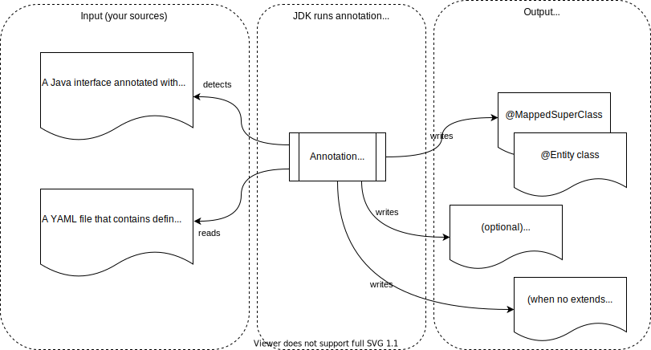

= Easy JPA Entities
:numbered:
:toc:

== Introduction

This is a Java library that generates JPA entities.

Purpose:: Using it for persistence in an application that uses https://spring.io/projects/spring-data-jpa[Spring Data JPA]
using immutable entities that you don't write yourself. Generated entities are _anemic_ classes: no behaviour is present.

What you should add yourself:: YAML file that contains definitions for your entities and let an annotation processor generate the entity classes for you.

After usage:: The easy-jpa-entities-processor dependency will continue to be a part of your build. You could decide to copy and paste the generated code to your source tree. In that case the easy-jpa-entities-processor dependency can be erased.

Benefits:: Entity classes are
* generated for you, including the builder
* immutable
* the same

Drawbacks::
Unless you modify the processor yourself, generated _form_ of the entities is always the same: there is not room for slight differences.

_Easy JPA Entities_ consists of a jar file that implements a https://www.baeldung.com/java-annotation-processing-builder[Java Annotation Processor]. When included in your project, it will search for an interface that is annotated with `@EasyJpaEntities`. It well derive the location of the YAML file from that annotation, and use the information in that file to generate JPA entity class files.

.Notes:
* Reason this library was created: I think https://dzone.com/articles/immutability-in-java[immutability] is a very good idea. I am aware of https://immutables.github.io/[Immutables] and https://projectlombok.org/[Lombok], but, to my humble opinion, these don't  play really well with JPA.
* The ID for the entity is assigned in the Java code. The examples use UUID IDs. You should be able to replace it with anything immutable you like.
* Not implementing setters does not make an entity immutable.
* Using this library can only be used for relatively simple entities. From what I understand from https://www.dddcommunity.org/library/vernon_2011/[_Effective Aggregate Design_] you should keep your entities simple anyway.
* The immutable entities generated are immutable in the Java programming space. It is *not* the same as https://www.baeldung.com/hibernate-immutable[@Immutable entities in Hibernate].

It should be compatible with JDK 8.

== Usage

Include the easy-jpa-entities artifact in your build. For example in Maven:

....
        <dependency>
            <groupId>io.github.gerardpi.easy-jpa-entities</groupId>
            <artifactId>easy-jpa-entities-processor</artifactId>
            <version>localbuild-SNAPSHOT</version>
            <scope>compile</scope>
        </dependency>
....

.This diagram indicates what is expected as input and what will be produced at build time

Create an interface, and include a YAML file with the same name with the entity definitions.

.Example:
* *Annotated file*: `easy-jpa-entities-test/src/main/java/io/github/gerardpi/easy/jpaentities/test1/_AnAnnotatedInterface.java` (this is the file to be found by the annotations processor)
* *Definitions file*: `easy-jpa-entities-test/src/main/resources/io/github/gerardpi/easy/jpaentities/test1/_AnAnnotatedInterface.yaml` (this file contains the actual definitions)

At compile time, the Java sources are being generated.

Refer to the example code in easy-jpa-entities-test/ for details.
Tests are written using https://jgiven.org/[jgiven]. These tests generate a scenario that looks a lot like https://en.wikipedia.org/wiki/Cucumber_(software)#Gherkin_language[Gherkin]. Have a look at the builds in the CI environment.

== CI environment

image::https://travis-ci.com/GerardPi/easy-jpa-entities.svg?branch=master[]

https://travis-ci.com/github/GerardPi/easy-jpa-entities
